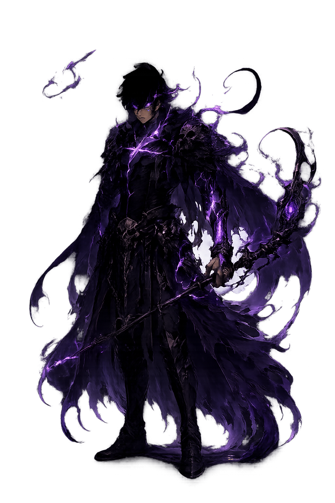

# Le trone du necromancien Game Architecture

Le trone du necromancien is a Python Ursina 2D in 3D geometry level based game. I created this game as a personal project that is continuously growing. My idea was to finally create my own thing without having to rely on crazy 3D animation. This is why I chose Ursina; the 2D to 3D geometry makes you think to play in first person in a 3D space but it makes it a lot easier for ,me as a programmer to "animate" entities (I wish I was animator, getting there maybe one day...). The structure and ideas a completely mine, and the code is fine tuned but essentially hand written. As of the design, since creating my own videogame art will rob me of way too much time, the designs are AI created with personal prompts. Maybe in the future I will be able to dedicate more time to making my own art and adding it to the game, since it is basically made out of 2D layers of images. I am still learning how to use Ursina, and the game will be continuously be updated.

## Game Description

The player finds himself entering a dungeon of the undead, where he has to defeat the manifestation of evil and the non-living. He descends into darkness and by going deeper into the dungeon he will gain magical powers and understand the creatures that roam around the depths, essentially and hopefully defeating them to come back to life.

"You abandonded the warmth of life to embrace a body of a dark being. The man you once were vanished long ago,

consumed by rituals, silence, and fading breaths. Now you walk amongst the undead, speaking to them as if they were 

one of your kind, for that you dont have anyone else to turn to anymore. You have abandoned the living, and they have

abandoned you. Deep beneath the ruined kingdoms, you face evil far older than mankind itself, it was your greed

that brought you here. Yet somewhere within the darkess, a fragile hope still remains, a light in the shadow, a silent

whisper of a life that has almost escaped your memory, a hope to reclaim the soul you once sacrificed."

## Design

  

(ctrl + shift +v to see readme status)